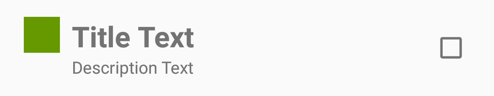

#  Fun? With RecyclerViews

## Introduction
> ***Note:*** _This can be a pair programming activity or done independently._

In this lab you will be using your knowledge of
RecyclerView to recreate the Views lab, but this time we have
different requirements.

## Starter Code
Starter code has been provided to help you along with the initial set up.

## Exercise

#### Requirements

##### Activities
- You have been provided two Activities a `MainActivity` and a `SecondaryActivity`

##### RecyclerView
- You have been provided a `RecyclerView` inside the **activity_main.xml** and **activity_secondary.xml**
- Get a reference to the `XML` created `RecyclerView` inside the `onCreate()` method in `Java` in both activities.
- Set up the layout manager for the `RecyclerView` in both activities.

---

##### Custom View Layouts
- Create two custom `XML` layouts that replicate these layouts.

##### Custom RecyclerView ViewHolders
- Create two custom `RecyclerView ViewHolders`.
- The `ViewHolders` should get a reference to each of the custom view layouts you created in `XML`.(one layout per custom `ViewHolder`).

##### Custom Objects
- Create two custom `Java` objects that hold this data:
- The first object should hold a `title`, a `description`, and a `color`.
- The second object should hold a `title`, a `description`, a `color`, and a `check` to see if the item was selected.
- Make sure you create `getters/setters` and `constructors` that will help you with the requirements.

##### Custom RecyclerView Adapters
- Create two custom `RecyclerView Adapters`.
- The adapters should use the custom `ViewHolders` (one ViewHolder per adapter).

---

##### OnClickListener
- For the first custom view, have the `OnClickListener` show a `Toast` that displays the title of the row.
- For the second custom view, have the `OnClickListener` show a `Toast` that changes the checked value of both the object and view. Add logic to make sure it maintains that checked state when scrolling.

---

##### MainActivity
- Create and populate a `List` that contains ten instances of one of your custom `Java` objects.
- Provide one of your custom adapters this list to use.
- Set your custom adapter on the `RecyclerView`.

##### SecondaryActivity
- Create and populate a `List` that contains ten instances of your other custom `Java` object.
- Provide the other custom adapter this list to use.
- Set your custom adapter on the `RecyclerView`.

---

**Bonus:**
How would you change your classes to allow for more than one type of view in one RecyclerView adapter?

#### Deliverable
A pull request from forked GitHub repo that contains your implementation of the requirements.

### Additional Resource:
[Android: RecyclerView](https://developer.android.com/training/material/lists-cards.html)
